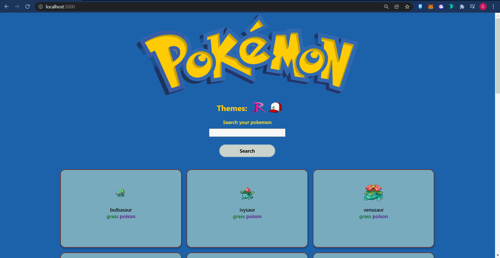

# PokeQuest

esse projeto foi proposto como desafio do curso DevQuest ele tem como propósito enviar dados de pokemons como suas habilidades e lista de movimentos trazendo os mesmos de uma API

## Funcionalidades

Esse projeto tem como funcionalidades mostrar pokemons na página inicial e após selecionar algum deles você verá os detalhes do mesmo assim como também poderá buscar pelo pokemon de sua preferência para que possa ver seus detalhes.

## Ferramentas utilizadas

-- React: foi utilizada pelo seu potencial de SPA(single page aplication) o que contribui bastante para esse projeto

-- React-router: ferramenta que proporciona a navegação dentro da SPA.

-- styled-components: estilos de maneira mais dinâmica podendo conter código javascript no mesmo.

## Decisões aplicadas

uma das principais decisões foi o de colocar o tipo do pokemon na tela inicial, outra decisão foi colocar os temas clara e escuro como algo que refletisse a própria atmosfera do pokemon como Ash Ketchum ou tema Treinador como tema claro e tema escuro para Equipe Rocket

## Para iniciar

para iniciar siga os seguintes passos :

-- faça o clone normalmente do repositório

-- utilize o comando: npm install

-- utilize o comando: npm start
